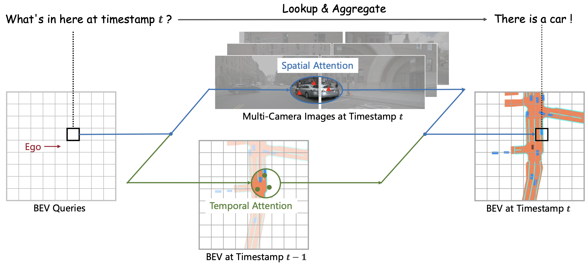
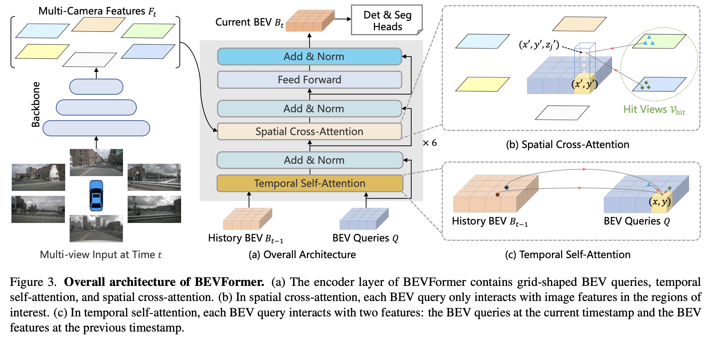

<div align="center">   
  
# Project: Bird’s-Eye-View Representation from Multi-Camera Images via Spatiotemporal Architecture
</div>



https://user-images.githubusercontent.com/27915819/161392594-fc0082f7-5c37-4919-830a-2dd423c1d025.mp4
# Changelog
This project is inspired by the [original BEVFormer repository](https://github.com/fundamentalvision/BEVFormer/blob/master/README.md).
In addition, we have adapted and implemented the codebase to be compatible with recent versions of PyTorch, MMCV, MMEngine, and other required libraries, ensuring smooth execution without GPU compatibility issues.
This project is intended for educational and learning purposes only, and does not aim to reproduce or claim original research contributions.

# Abstract
This project implements a BEVFormer-based framework for 3D perception from multi-camera images in autonomous driving. 
It learns a unified Bird’s-Eye-View (BEV) representation using spatiotemporal transformers. The model leverages spatial cross-attention to extract features from multiple camera views and temporal self-attention to fuse historical BEV information, enabling the capture of both spatial context and motion dynamics. This work focuses on reproducing and understanding the core components of BEVFormer.

# Models


# Getting Started
### Create virtual environment and install dependencies
```bash
uv venv --python 3.10.0
uv pip install -e .
```

### Prepare data
Run command to download can bus and nuscene data from [repo](https://huggingface.co/datasets/5421Project/nuscene).
```bash
uv run src/tools/download_data.py \
    --repo 5421Project/nuscene \
    --out-dir data \
    --version v1.0-mini \
    --flag nuscenes
```
From here, can visualize data sample (see [visualize.ipynb](notebooks/visualize.ipynb)).

Run command to prepare metadata

```bash
 uv run src/tools/create_data.py nuscenes \
    --root-path data/nuscenes \
    --version v1.0-mini \
    --extra-tag nuscenes \
    --canbus data/nuscenes/can_bus 
```

Using the above code will generate `nuscenes_infos_temporal_{train,val}.pkl`
in ``data/nuscenes/v1.0-mini/``.

Folder structure after downloading and preparing data looks like
```
bevformer/
├── data/
│   ├── nuscenes/
│   │   ├── can_bus/
│   │   ├── v1.0-mini/
│   │   │   ├── maps/
│   │   │   ├── reverse/
│   │   │   ├── samples/
│   │   │   ├── sweeps/
│   │   │   ├── v1.0-mini/
│   |   |   ├── nuscenes_infos_temporal_train.json
│   |   |   ├── nuscenes_infos_temporal_train.pkl
│   |   |   ├── nuscenes_infos_temporal_val.json
│   |   |   ├── nuscenes_infos_temporal_val.pkl
```


# Train
Run below command to see training instructions:
```bash
uv run train.py --help
```

Then train by, can leave everything default:
```bash
uv run train.py \
   --config configs/bevformer_tiny_test.py \
   --work-dir experiment \
   --experiment-name baseline
```

Checkpoints are pushed to repo **[5421Project](https://huggingface.co/datasets/5421Project)/{experiment_name}** intervally.


# Config
See [bevformer_tiny_test.py](configs/bevformer_tiny_test.py) to understand config and edit if needed.

# Acknowledgement

Many thanks to these excellent open source projects:
- [dd3d](https://github.com/TRI-ML/dd3d) 
- [detr3d](https://github.com/WangYueFt/detr3d) 
- [mmdet3d](https://github.com/open-mmlab/mmdetection3d)
- [BEV](https://github.com/fundamentalvision/BEVFormer/blob/master/README.md)